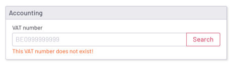
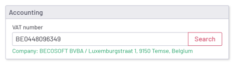
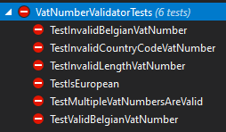
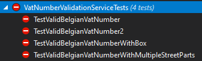

# Development test

## Context: VAT Number and Validation
### What is a VAT Number?
A VAT (Value Added Tax) number is a unique identification number that businesses within the European Union (EU) use for tax purposes. This number is essential for correctly handling VAT payments on transactions within and outside the EU.

### What is VIES?
VIES (VAT Information Exchange System) is an online system provided by the European Commission that allows businesses and tax authorities to verify the validity of a VAT number. This system helps prevent fraud and ensures compliance with European tax regulations.

### The Importance of VAT Number Validation
Verifying the validity of a VAT number is crucial for businesses engaged in international trade. An invalid VAT number can lead to financial and tax-related consequences, such as:
- **Additional tax obligations**: If a VAT number is invalid, the transaction is not considered an intra-community supply, meaning the seller must still pay VAT.
- **Fines and penalties**: Authorities may impose fines for incorrect VAT reporting.
- **Delays in transactions**: An incorrect VAT number can cause administrative issues and delay payments.

### Consequences of Invoicing to Other Countries
When a business issues an invoice to a customer in another EU country, it can apply a 0% VAT rate under certain conditions. One of these conditions is that the customer has a valid VAT number. If the provided VAT number is invalid, the seller must still pay the VAT, leading to unexpected costs.
Therefore, it is crucial to verify each international customer’s VAT number through VIES or the national tax authority before completing the transaction.

## Tool: VAT Number Validation System

The VAT Number Validation System is a tool designed to help businesses verify VAT numbers efficiently and accurately. It performs two key functions:
1. Standard VAT Number Format Validation
  - The tool checks whether the VAT number follows the correct format based on the structure defined by each EU country.
  - It validates elements such as the country code, number of digits, and character composition (e.g., numeric or alphanumeric).
  - Helps detect typographical errors before performing a live validation via VIES, reducing unnecessary API requests.
2. VAT Number Validation via VIES
  - The tool connects to the VAT Information Exchange System (VIES) to check whether a given VAT number is valid and registered with the appropriate tax authority in an EU member state.
  - It returns information about the VAT number’s status, including the company name and address (if available).

> Remark: We simulate the VIES-connection due to instability and connectivity issues.
 
## Functional Requirements – VAT Number Validation Tool
### General Requirements
- The tool must be developed following the MVC (Model-View-Controller) pattern.
- All operations must be asynchronous.

### Features
#### VAT Number Input
Users must have an input field to enter a VAT number.

#### Validation via VIES
The tool must make an asynchronous service call to connect with the VIES system.

### Display of Results
- **For a valid VAT number**:
  - Confirmation that the number is valid.
  - Additional details such as company name and address (if available via VIES).
- **For an invalid VAT number**:
  - A clear message indicating that the number is not valid.
  - An option to enter a new VAT number.

### Technical Requirements
#### MVC View:
- A simple frontend interface where users can enter a VAT number.
- Display results on the same page without reloading:
  - Use resources for labels (you can use ResXManager in VS).
  - Show the address data in a structured way.
  - Show the correctly formatted VAT number when a valid response is received.

#### MVC Controller:
A controller with an action to process the VAT number and send it to the service.

#### Unit Tests:
> Use NUnit 3 Test Adapter to run the tests

Fix the existing unit tests:

Add the necessary code in ViesAddressParser (starting from line 16) to ensure that as many tests as possible pass. Use the content of the tests to determine what needs to be done:

